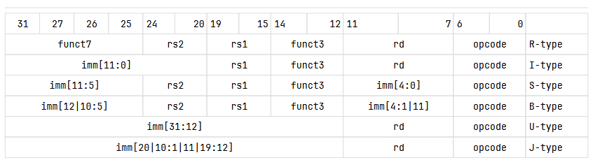

# Keywords
- **Upper Immediate Instruction Format (U-Type)** - Used for operations that deal with large chucks of data (the upper 20 bits of the instruction). It consists of an immediate field (the data), a destination register
- **Register Type Instruction Format (R-type)** - a format where all bit fields represent registers. Used by xRET instructions (e.g MRET, SRET, URET)
- **RV32I** and **RV64I** - represents two different RISCV ISAs with different base integer register widths (32 and 64 bit, respectively)
- **custom-0** - defines an opcode label that is left intentionally blank (guaranteed to never be claimed by future or present RISCV extensions). Therefore, it can be used by people writing experimental extensions. The opcode value is `0b0001011` (0x0B)

# Bit field descriptions for various instruction formats in RISCV

| Field | Formats | Description |
| :--- | :--- | :--- |
| **opcode** | All | 7-bit instruction class identifier. Shared across formats; never fully identifies an instruction on its own. |
| **rd** | R, I, U, J | Destination register. The index (0–31) of the register the result is written to. |
| **funct3** | R, I, S, B | 3-bit sub-opcode. Narrows down which operation is being performed within the opcode class. |
| **rs1** | R, I, S, B | Source register 1. Index of the first register input operand. |
| **rs2** | R, S, B | Source register 2. Index of the second register input operand. |
| **funct7** | R | 7-bit further qualifier. Distinguishes operations that share an opcode and funct3 (e.g. ADD vs SUB, SRL vs SRA). |
| **imm[11:0]** | I | 12-bit signed immediate, sign-extended to XLEN at use. Used for offsets, CSR numbers, or small constants. |
| **imm[11:5] / imm[4:0]** | S | A 12-bit signed immediate split across two fields (to keep rs1/rs2 in the same bit positions as R-type). Reassembled as imm[11:5] \| imm[4:0]. |
| **imm[12\|10:5] / imm[4:1\|11]** | B | A 13-bit signed branch offset, stored scrambled. Bit 12 is the sign, bits 10:5 are in the upper field, bits 4:1 and 11 are in the lower field. Always a multiple of 2 (bit 0 is implicitly 0). |
| **imm[31:12]** | U | 20-bit upper immediate. Placed in the top 20 bits of a 32-bit value (lower 12 bits are zeroed). Used by LUI and AUIPC. |
| **imm[20\|10:1\|11\|19:12]** | J | A 21-bit signed jump offset, stored scrambled similarly to B-type. Bit 20 is the sign, then bits 10:1, 11, and 19:12. Always a multiple of 2 (bit 0 implicitly 0). |

# Considerations for using U-Type instruction format
- U-Type instructions don't have any funct bit fields, which means you're basically limited to a single instruction under this opcode
    - Will we need to implement anymore custom instructions besides APRET?
- Considering the immediate bit field only holds a given index for an Anticipation Point, it is unlikely that a given program will have 2^19 anticipation points (will this even fit in CSR memory? My intuition says no lol).

# Proposed Layout for the APRET Instruction
The APRET instruction uses the Anticipation Point index to set the Program Counter to the address stored in APEPC

| imm\[31:12\] | rd | opcode |
| :--- | :--- | :--- |
| index of the AP to reference | 0b00000 | 0b0001011 (custom-0) |

# Questions
- Just wondering, but since we are avoiding conventional trap/interrupt pipelines for APRET, is it valid to call it a trap-return instruction? Maybe the fact that we are using U-Type instead of R-Type automatically answers my question
